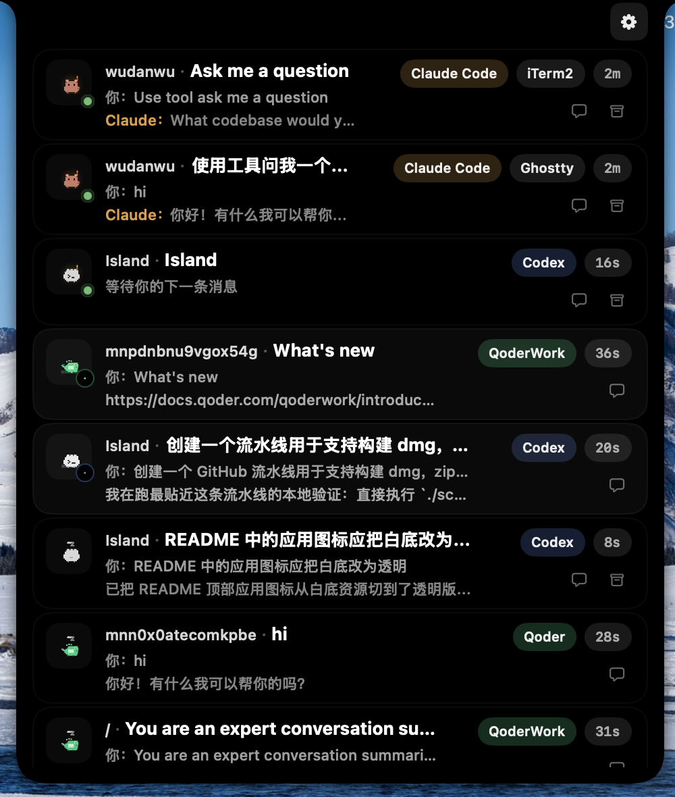
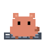
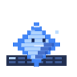
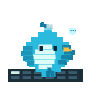
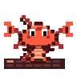
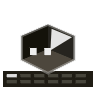
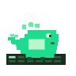
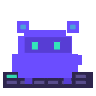
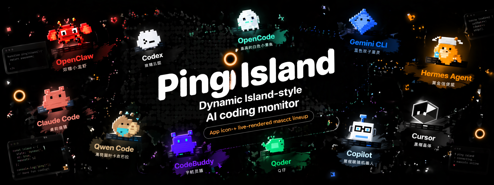

<h1 align="center">
  &nbsp;
  Ping Island
</h1>
<p align="center">
  <b>Dynamic Island-style AI coding session monitor for the macOS menu bar</b><br>
  <a href="https://erha19.github.io/">Website</a> •
  <a href="#installation">Install</a> •
  <a href="#features">Features</a> •
  <a href="#supported-tools">Supported Tools</a> •
  <a href="#build-from-source">Build</a><br>
  English | <a href="README.zh-CN.md">简体中文</a>
</p>

<p align="center">
  <a href="https://github.com/erha19/ping-island/releases">
    
  </a>
  <a href="https://github.com/erha19/ping-island/releases">
    
  </a>
  
  
  
  
</p>

<p align="center">
  
</p>


<p align="center">
  <sub>Watch active coding sessions, answer follow-up questions, and jump back to the right terminal or IDE window.</sub>
</p>

<p align="center">
  <sub>Official website: <a href="https://erha19.github.io/ping-island/">erha19.github.io/ping-island</a></sub>
</p>

<p align="center">
  &nbsp;
  &nbsp;
  &nbsp;
  &nbsp;
  &nbsp;
  &nbsp;
  &nbsp;
  &nbsp;
  &nbsp;
  &nbsp;
  
</p>
<p align="center">
  <sub>Claude Code · Codex · Gemini CLI · Hermes Agent · Qwen Code · OpenClaw · OpenCode · Cursor · Qoder · CodeBuddy · GitHub Copilot</sub>
</p>

## What is Ping Island?

Ping Island is a macOS menu bar app that expands into a Dynamic Island-style surface when your coding agents need attention. It listens to Claude-style hooks, Codex hooks, Gemini CLI hooks, Hermes Agent plugin hooks, Qwen Code hooks, OpenClaw internal hooks plus session transcripts, the Codex app-server, OpenCode plugins, and compatible IDE integrations so approvals, input requests, completions, and session summaries show up without babysitting terminal tabs.

If you have seen [Vibe Island](https://vibeisland.app/), Ping Island is positioned as an independent open-source alternative in the same category: a native macOS notch/menu bar surface for monitoring and controlling AI coding sessions.

## Features

Ping Island focuses on the moments that actually interrupt coding flow, then keeps them visible and actionable from a native macOS notch surface.

- **Attention-first UI** - Stay compact until a session needs approval, input, review, or intervention.
- **Act from the notch** - Approve tools, deny requests, and answer follow-up prompts without hunting through tabs.
- **Claude Code auto-approve** - Turn on per-session auto-approval when you want Claude Code to stop pausing on every permission request.
- **One-click return** - Jump back to the right iTerm2, Ghostty, Terminal.app, tmux pane, or IDE window.
- **SSH terminal support** - Bootstrap a remote PingIslandBridge over SSH, rewrite the remote Claude-compatible hooks to point back at your Mac, and keep remote terminal activity visible in the same local Island UI.
- **Multi-agent coverage** - Track Claude Code, Codex, Gemini CLI, Hermes Agent, Qwen Code, OpenClaw, OpenCode, Cursor, Qoder, CodeBuddy, WorkBuddy, GitHub Copilot, and other compatible sessions in one place.
- **OpenClaw gateway support** - Follow OpenClaw sessions from managed internal hooks, then refill the conversation from OpenClaw's local session transcripts so the Island UI can show the actual back-and-forth instead of a single inbound message.
- **Codex hook + app-server sync** - Support Codex CLI hooks, live app-server threads, and rollout parsing fallback when needed.
- **Custom sounds** - Pick per-event macOS sounds or import local sound packs for your own notification style.
- **Custom agent mascots** - Give each client its own animated mascot override across the notch, session list, and hover UI.
- **Hermes courier-fox mascot** - Hermes Agent uses a gold courier fox with a winged helmet and satchel so plugin-hook sessions stay visually distinct from the Claude/Qwen family.
- **Qwen capybara mascot** - Qwen Code now ships with a mint-scarf capybara mascot tuned for prompt, reply, and notification-heavy flows.

<a id="supported-tools"></a>
## Supported Tools

<p align="center">
  
</p>

Ping Island also ships VS Code-compatible focus extensions for VS Code, Cursor, CodeBuddy, WorkBuddy, and Qoder. `QoderWork` is hook-only today and does not participate in the IDE extension path.

Hermes Agent is integrated through a generated plugin directory at `~/.hermes/plugins/ping_island/`. Hermes' gateway hook directories under `~/.hermes/hooks/` do not run in the CLI, so Ping Island uses the official `ctx.register_hook()` plugin surface to observe prompt submission, tool activity, model replies, and session end events.

<p align="center">
  
</p>

Qwen Code is supported as a first-class hook client through `~/.qwen/settings.json`, and its built-in mascot is the mint-scarf capybara shown in the README GIF strip. The visual is meant to feel calm and dependable, while still carrying a small Qwen-tinted scarf and reply bubble instead of another generic bird or blob.

OpenClaw is supported through a managed internal hook directory under `~/.openclaw/hooks/` plus transcript-aware session refresh from `~/.openclaw/agents/main/sessions/`. That combination lets Ping Island surface OpenClaw's lightweight message hooks quickly, then backfill the full conversation from the local session log once the assistant reply lands.

SSH support is a core workflow, not a sidecar script. Ping Island can bootstrap a bridge onto a remote macOS or Linux host, rewrite remote Claude-compatible and Qwen Code hook configs to use that bridge, install supported OpenClaw internal hooks on the remote host, and keep a bidirectional forwarding path back into the local menu-bar UI. That means approvals, follow-up questions, notifications, and jump-back routing from remote SSH terminals still land in the same Island surface on your Mac.

The mascot GIFs used throughout this README are generated from the live `MascotView` implementation via `./scripts/render-mascots.sh`.
The Hermes feature poster in `docs/images/ping-island-hermes-poster.png` is generated via `./scripts/render-hermes-poster.sh`.
The OpenClaw feature poster in `docs/images/ping-island-openclaw-poster.png` is generated via `./scripts/render-openclaw-poster.sh`.

<a id="installation"></a>
## Installation

### Download a Release

1. Visit the [official website](https://erha19.github.io/ping-island/) for the product overview and latest download link, or go straight to [Releases](https://github.com/erha19/ping-island/releases).
2. Download the latest DMG.
3. Move `Ping Island.app` into your Applications folder.
4. Launch the app and start the clients you want Ping Island to monitor.

> On first launch, macOS may ask you to confirm the app or grant Accessibility / Apple Events permissions for focus features.

<a id="build-from-source"></a>
### Build from Source

Requires macOS 14+ and an Xcode toolchain that can build the Xcode project and the Swift 6.1 `Prototype` package tests.

```bash
git clone https://github.com/erha19/ping-island.git
cd ping-island

# Debug build
xcodebuild -project PingIsland.xcodeproj -scheme PingIsland -configuration Debug build

# Release build
xcodebuild -project PingIsland.xcodeproj -scheme PingIsland -configuration Release build
```

To create a locally shareable unsigned package for local testing:

```bash
./scripts/package-unsigned.sh
```

The script re-signs the built app bundle with a consistent ad-hoc signature before creating the `.dmg` and `.zip`, which helps embedded frameworks launch more reliably on another machine. The package is still unsigned for distribution and not notarized, so first launch may still require `Open` from Finder's context menu or manual quarantine removal.
The generated files land in `releases/unsigned/` as `PingIsland-<version>.dmg` and `PingIsland-<version>.zip`.

To create signed and notarized release packages in GitHub Actions, configure the release secrets described in [docs/sparkle-release.md](docs/sparkle-release.md) and run `.github/workflows/release-packages.yml` against a `v*` tag or the manual workflow dispatch input.

The same workflow also publishes a Linux `PingIslandBridge` asset that Ping Island can download when bootstrapping Linux SSH hosts.

For the full notarized release flow and the GitHub Releases backed Sparkle appcast setup, see [docs/sparkle-release.md](docs/sparkle-release.md).

## Testing

The fastest full-repo regression path is:

```bash
./scripts/test.sh
```

That covers:

```bash
swift test --package-path Prototype
xcodebuild -project PingIsland.xcodeproj -scheme PingIsland -configuration Debug CODE_SIGNING_ALLOWED=NO test -only-testing:PingIslandTests
xcodebuild -project PingIsland.xcodeproj -scheme PingIsland -configuration Debug CODE_SIGN_IDENTITY=- test
```

Useful targeted slices:

```bash
swift test --package-path Prototype --filter IslandBridgeE2ETests
xcodebuild -project PingIsland.xcodeproj -scheme PingIsland -configuration Debug CODE_SIGNING_ALLOWED=NO test -only-testing:PingIslandTests
xcodebuild -project PingIsland.xcodeproj -scheme PingIsland -configuration Debug CODE_SIGN_IDENTITY=- test -only-testing:PingIslandUITests
```

If `PingIslandUITests-Runner` stays suspended on macOS, run the UI tests from Xcode with a valid local signing identity and check `amfid` / `AppleSystemPolicy` logs before treating it as an app regression.

## Settings

Ping Island currently ships a 4-category settings panel:

- **General** - launch at login and baseline app behavior
- **Display** - notch display target and placement behavior
- **Mascot** - client mascot previews, per-client overrides, animation states
- **Sound** - event-specific sounds, sound pack mode, sound pack import

## Custom Sounds

Ping Island currently supports three sound modes under `Settings -> Sound`:

- **System sounds** - choose a macOS sound for each event.
- **Built-in 8-bit** - use Island's bundled retro sound set, including the fixed client startup sound.
- **Sound pack** - load a local OpenPeon / CESP-compatible pack from disk.

### Quick setup

1. Open `Settings -> Sound`.
2. Turn on `Enable sounds`.
3. Pick the mode you want:
   - `System sounds` if you just want a different macOS sound per event.
   - `Sound pack` if you want fully custom audio files.
4. Preview each event with the play button and leave only the event toggles you want enabled.

### Import a local sound pack

1. Switch `Sound mode` to `Sound pack`.
2. Click `Import local sound pack`.
3. Choose a folder that contains `openpeon.json`.
4. Pick the imported pack from the `Sound pack` dropdown.

Ping Island also auto-discovers packs placed under `~/.openpeon/packs` and `~/.claude/hooks/peon-ping/packs`.

### Minimal sound pack layout

```text
my-pack/
  openpeon.json
  session-start.wav
  attention.ogg
  complete.mp3
  error.wav
  limit.wav
```

```json
{
  "cesp_version": "1.0",
  "name": "my-pack",
  "display_name": "My Pack",
  "categories": {
    "task.acknowledge": {
      "sounds": [{ "file": "session-start.wav", "label": "Session Start" }]
    },
    "input.required": {
      "sounds": [{ "file": "attention.ogg", "label": "Attention" }]
    },
    "task.complete": {
      "sounds": [{ "file": "complete.mp3", "label": "Complete" }]
    },
    "task.error": {
      "sounds": [{ "file": "error.wav", "label": "Error" }]
    },
    "resource.limit": {
      "sounds": [{ "file": "limit.wav", "label": "Limit" }]
    }
  }
}
```

### Event mapping

- `Processing started` checks `task.acknowledge`, then `session.start`.
- `Attention required` checks `input.required`.
- `Task completed` checks `task.complete`.
- `Task error` checks `task.error`.
- `Resource limit` checks `resource.limit`.

Release builds can also publish a Linux `PingIslandBridge` artifact alongside the macOS app packages, which Ping Island uses when bootstrapping remote SSH hosts that are not running macOS.

Sound packs can use `.wav`, `.mp3`, or `.ogg` files. If a selected pack does not provide a matching category for an event, Ping Island falls back to the macOS system sound selected for that event.

## How It Works

```text
Claude / Codex / Gemini CLI / OpenCode / Cursor / Qoder / CodeBuddy / WorkBuddy / Copilot / ...
  -> hook or app-server event
    -> Ping Island monitor + normalization layer
      -> SessionStore
        -> SessionMonitor / NotchViewModel
          -> notch, list, hover preview, completion popup
```

Implementation details worth knowing:

- Claude-family tools enter through managed hook files plus the embedded `PingIslandBridge` launcher.
- Codex sessions can come from hook events or the live `codex app-server` websocket monitor.
- Gemini CLI hooks are installed into `~/.gemini/settings.json`; tool matchers use Gemini's regex-based hook matcher syntax.
- Qwen Code hooks are installed into `~/.qwen/settings.json`; the bridge follows the official event names and uses `Stop` / `SessionEnd` / `Notification` messages to surface popup-ready summaries in Island.
- OpenCode is wired through a generated plugin file under `~/.config/opencode/plugins/`.
- Remote SSH hosts can bootstrap `PingIslandBridge`, rewrite remote Claude-compatible hooks to target that bridge, and forward remote events back into the local Ping Island UI.
- Focus routing spans iTerm2, Ghostty, Terminal.app, tmux, and VS Code-compatible IDE extensions.

## Requirements

- macOS 14.0 or later
- Best experience on MacBooks with a notch, but external displays are supported too
- Install whichever CLI or desktop clients you want Ping Island to monitor

## Acknowledgments

Ping Island follows the lineage of notch-first agent monitors such as [claude-island](https://github.com/farouqaldori/claude-island), and adapts that idea into a broader multi-client session surface with hooks, app-server sync, and IDE routing.

## License

Apache 2.0 - see [LICENSE.md](LICENSE.md).
