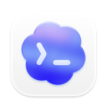
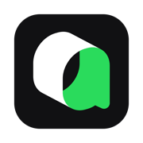

<h1 align="center">
  &nbsp;
  Ping Island
</h1>
<p align="center">
  <b>macOS 菜单栏里的灵动岛风格 AI 编码会话监视器</b><br>
  <a href="#installation">安装</a> •
  <a href="#features">功能</a> •
  <a href="#supported-tools">支持的工具</a> •
  <a href="#build-from-source">构建</a><br>
  <a href="README.md">English</a> | 简体中文
</p>

<p align="center">
  <a href="https://github.com/erha19/ping-island/releases">
    
  </a>
  <a href="https://github.com/erha19/ping-island/releases">
    
  </a>
  
  
  
  
</p>

<p align="center">
  
</p>
<p align="center">
  <sub>在菜单栏里查看活跃编码会话、回答追问，并一键跳回正确的终端或 IDE 窗口。</sub>
</p>

<p align="center">
  &nbsp;
  &nbsp;
  &nbsp;
  &nbsp;
  &nbsp;
  &nbsp;
  &nbsp;
  
</p>
<p align="center">
  <sub>Claude Code · Codex · Gemini CLI · OpenCode · Cursor · Qoder · CodeBuddy · GitHub Copilot</sub>
</p>

## Ping Island 是什么？

Ping Island 是一个 macOS 菜单栏应用。当你的编码 Agent 需要你处理审批、输入或查看结果时，它会展开成一个类似 Dynamic Island 的悬浮界面。它能接 Claude 风格 hooks、Codex hooks、Gemini CLI hooks、Codex app-server、OpenCode 插件，以及兼容 IDE 的集成层，所以你不用一直盯着终端标签页，也能看到会话状态。

如果你了解过 [Vibe Island](https://vibeisland.app/)，可以把 Ping Island 理解成同一产品方向下的独立开源替代方案：它同样是一个原生 macOS 刘海区 / 菜单栏界面，用来监控和控制 AI 编码会话。

项目当前的主运行链路很直接：

```text
Hook / app-server 事件
  -> 监控与服务层
    -> SessionStore
      -> SessionMonitor + NotchViewModel
        -> 刘海 UI、会话列表、hover 预览、完成提醒
```

<a id="features"></a>
## 功能特性

Ping Island 关注的，是那些真正会打断编码节奏的时刻，并把它们用原生 macOS 刘海界面接住。

- **先感知，再展开** - 平时保持紧凑，只有在会话需要审批、输入、查看结果或人工介入时才展开。
- **原地处理** - 直接在刘海界面里批准工具调用、拒绝请求、回答追问。
- **一键跳回现场** - 快速回到对应的 iTerm2、Ghostty、Terminal.app、tmux pane 或 IDE 窗口。
- **多 Agent 统一收口** - 在一个菜单栏入口里持续跟踪 Claude Code、Codex、Gemini CLI、OpenCode、Cursor、Qoder、CodeBuddy、GitHub Copilot 等兼容会话。
- **Codex hooks + app-server** - 同时支持 Codex CLI hooks、实时 app-server 线程同步，以及 rollout 解析兜底。
- **自定义音效** - 可按事件选择 macOS 系统音，也支持导入本地 sound pack。
- **自定义 Agent 形象** - 可按客户端覆盖专属吉祥物，并同步到 notch、会话列表和 hover 预览。

<a id="supported-tools"></a>
## 支持的工具

| 图标 | 工具 | 接入方式 | 跳转 | 覆盖范围 |
|:---:|------|----------|------|----------|
|  | Claude Code | Claude hooks | 终端、tmux、IDE 内终端 | 审批、提问、压缩、完成提醒 |
|  | Codex App + Codex CLI | Codex app-server、hooks、rollout 解析兜底 | Codex 应用、终端 | 审批、输入请求、线程同步 |
|  | Gemini CLI | Gemini CLI hooks（`~/.gemini/settings.json`） | 兼容终端宿主 | 会话生命周期、工具活动、通知、压缩前事件 |
|  | OpenCode | 托管插件文件 | OpenCode 应用、终端 | 插件事件转发到同一套 Island UI |
|  | Cursor | Claude 兼容 hooks + 可选 IDE 扩展 | 项目窗口 + 对应终端 | IDE 路由与终端精准聚焦 |
|  | Qoder/QoderWork/... | Qoder、QoderWork、Qoder CLI、JetBrains 兼容路径 | Qoder / QoderWork 窗口、终端 | 会话跳转、审批、提醒 |
|  | CodeBuddy | Hook 集成 + 可选 IDE 扩展 | 应用窗口 + 终端 | Claude 家族会话跟踪 |
|  | GitHub Copilot | Copilot hook 协议 | 兼容终端宿主 | Copilot CLI / Agent hooks 事件 |

Ping Island 另外还提供 VS Code 兼容的聚焦扩展，可用于 VS Code、Cursor、CodeBuddy、Qoder 和 QoderWork。`QoderWork` 目前仍然以 hook 接入为主，只有在对应 IDE 宿主可用时才会走扩展路径。

<a id="installation"></a>
## 安装

### 下载发行版

1. 打开 [Releases](https://github.com/erha19/ping-island/releases)
2. 下载最新的 DMG 或 zip 包
3. 将 `Ping Island.app` 拖到 Applications
4. 启动应用，并打开你希望 Ping Island 监控的客户端

> 首次启动时，macOS 可能会要求你确认应用，或授予辅助功能 / Apple Events 权限以支持聚焦能力。

<a id="build-from-source"></a>
### 从源码构建

需要 macOS 14+，以及能同时构建 Xcode 工程和 Swift 6.1 `Prototype` 测试包的 Xcode 工具链。

```bash
git clone https://github.com/erha19/ping-island.git
cd ping-island

# Debug 构建
xcodebuild -project PingIsland.xcodeproj -scheme PingIsland -configuration Debug build

# Release 构建
xcodebuild -project PingIsland.xcodeproj -scheme PingIsland -configuration Release build
```

如果你想产出本地分发用的未签名安装包：

```bash
./scripts/package-unsigned.sh
```

完整的 Sparkle / notarization 发布流程见 [docs/sparkle-release.md](docs/sparkle-release.md)。

## 测试

整仓库的最快完整回归入口是：

```bash
./scripts/test.sh
```

它会覆盖：

```bash
swift test --package-path Prototype
xcodebuild -project PingIsland.xcodeproj -scheme PingIsland -configuration Debug CODE_SIGNING_ALLOWED=NO test -only-testing:PingIslandTests
xcodebuild -project PingIsland.xcodeproj -scheme PingIsland -configuration Debug CODE_SIGN_IDENTITY=- test
```

常用分片：

```bash
swift test --package-path Prototype --filter IslandBridgeE2ETests
xcodebuild -project PingIsland.xcodeproj -scheme PingIsland -configuration Debug CODE_SIGNING_ALLOWED=NO test -only-testing:PingIslandTests
xcodebuild -project PingIsland.xcodeproj -scheme PingIsland -configuration Debug CODE_SIGN_IDENTITY=- test -only-testing:PingIslandUITests
```

如果 `PingIslandUITests-Runner` 在 macOS 上一直停在 suspended，优先在 Xcode 里用有效本地签名身份跑 UI 测试，并结合 `amfid` / `AppleSystemPolicy` 日志判断是不是代码签名或系统策略问题。

## 设置面板

Ping Island 当前提供 4 个设置分类：

- **General** - 登录启动与基础行为
- **Display** - 显示器选择与位置行为
- **Mascot** - 宠物预览、客户端覆盖、动作状态
- **Sound** - 事件声音、声音包模式、声音包导入

## 自定义音效

Ping Island 在 `设置 -> Sound` 里提供三种声音模式：

- **系统音** - 为每个事件单独选择一个 macOS 系统音。
- **内置 8-bit** - 使用 Island 自带的复古音效集，并包含固定的客户端启动音。
- **主题包** - 从本地导入兼容 OpenPeon / CESP 的音效包。

### 快速配置

1. 打开 `设置 -> Sound`。
2. 开启 `启用提示音`。
3. 选择你需要的模式：
   - 如果只是想给不同事件换系统提示音，选 `系统音`。
   - 如果想使用自己的音频文件，选 `主题包`。
4. 用每一行右侧的试听按钮确认效果，并只保留你需要的事件开关。

### 导入本地主题包

1. 将 `声音模式` 切到 `主题包`。
2. 点击 `导入本地主题包`。
3. 选择一个包含 `openpeon.json` 的目录。
4. 在 `主题包` 下拉框里选中刚导入的包。

Ping Island 也会自动发现放在 `~/.openpeon/packs` 和 `~/.claude/hooks/peon-ping/packs` 下面的主题包。

### 最小目录结构

```text
my-pack/
  openpeon.json
  session-start.wav
  attention.ogg
  complete.mp3
  error.wav
  limit.wav
```

```json
{
  "cesp_version": "1.0",
  "name": "my-pack",
  "display_name": "My Pack",
  "categories": {
    "task.acknowledge": {
      "sounds": [{ "file": "session-start.wav", "label": "Session Start" }]
    },
    "input.required": {
      "sounds": [{ "file": "attention.ogg", "label": "Attention" }]
    },
    "task.complete": {
      "sounds": [{ "file": "complete.mp3", "label": "Complete" }]
    },
    "task.error": {
      "sounds": [{ "file": "error.wav", "label": "Error" }]
    },
    "resource.limit": {
      "sounds": [{ "file": "limit.wav", "label": "Limit" }]
    }
  }
}
```

### 事件映射

- `开始处理` 会依次检查 `task.acknowledge`、`session.start`。
- `需要介入` 会检查 `input.required`。
- `完成` 会检查 `task.complete`。
- `任务失败` 会检查 `task.error`。
- `资源受限` 会检查 `resource.limit`。

主题包里的音频文件支持 `.wav`、`.mp3`、`.ogg`。如果当前主题包没有提供某个事件对应的分类，Ping Island 会回退到该事件当前选中的 macOS 系统音。

## 工作原理

```text
Claude / Codex / Gemini CLI / OpenCode / Cursor / Qoder / CodeBuddy / Copilot / ...
  -> hook 或 app-server 事件
    -> Ping Island 监控与归一化层
      -> SessionStore
        -> SessionMonitor / NotchViewModel
          -> 刘海、列表、hover 预览、完成提示
```

几个实现细节：

- Claude 家族工具主要通过托管 hook 文件和内嵌的 `PingIslandBridge` 启动器接入。
- Codex 会话既可以来自 hooks，也可以来自 `codex app-server` websocket 实时同步。
- Gemini CLI hooks 会安装到 `~/.gemini/settings.json`，其中工具 matcher 要使用 Gemini 的正则语法。
- OpenCode 使用生成到 `~/.config/opencode/plugins/` 下的插件文件接入。
- 聚焦路由覆盖 iTerm2、Ghostty、Terminal.app、tmux 和 VS Code 兼容 IDE 扩展。

## 系统要求

- macOS 14.0 或更高
- 在带刘海的 MacBook 上体验最好，但也支持外接显示器
- 安装你希望 Ping Island 监控的 CLI 或桌面客户端

## 致谢

Ping Island 延续了 [claude-island](https://github.com/farouqaldori/claude-island) 这类刘海式 Agent 监视器的思路，并把它扩展到了多客户端 hooks、Codex app-server 同步和 IDE 路由能力上。

## 许可证

Apache 2.0，详见 [LICENSE.md](LICENSE.md)。
